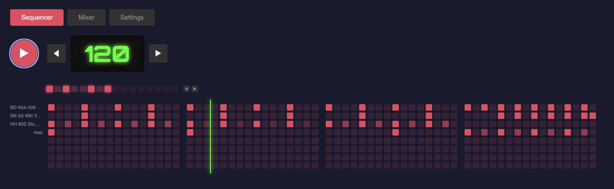

# AI DAW



- CBDC - Chat Based Drum Computer

## Setup

```bash
npm install
npm run build
```

## Usage

Play live:

```bash
clj -M:play
```

The web mixer UI starts automatically at http://localhost:3015

## Development

For ClojureScript hot-reload:

```bash
npm run dev
```

## Export

Export 8 bars to WAV:

```bash
clj -X:export
clj -X:export :filename '"my-beat.wav"'
```

## Tracks

1. https://soundcloud.com/eighttrigrams/ai-daw-hello-world

## Data Model

- No Patterns
- Instead Sequences, non to be repeated (in contrast to patterns) sequences of up to 16 bars, which connect to songs